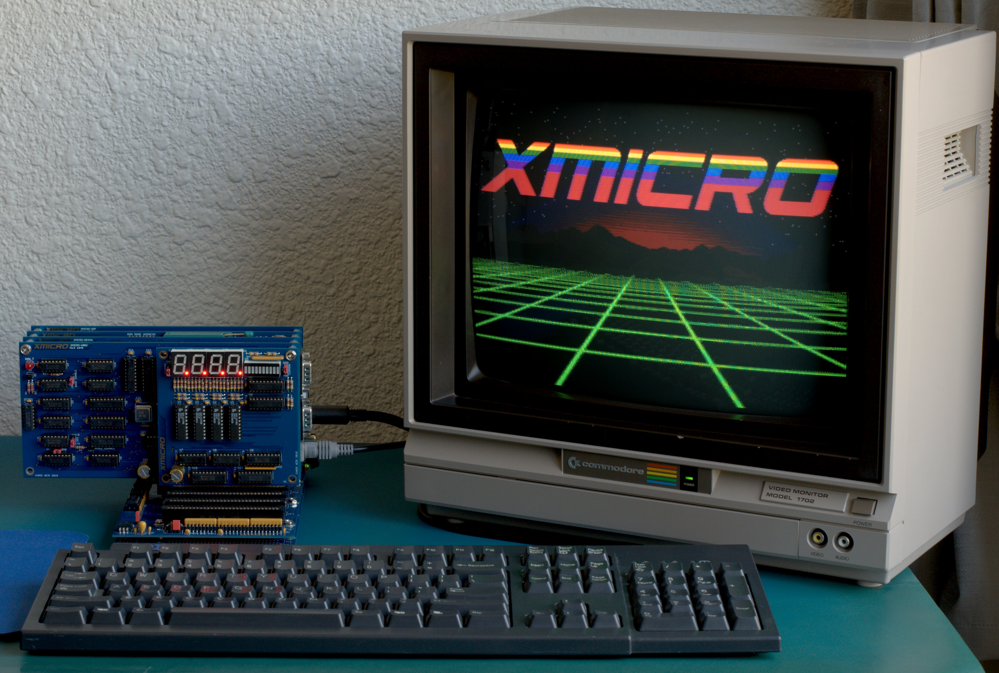
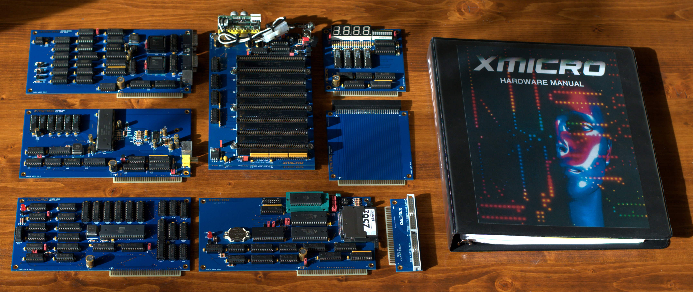
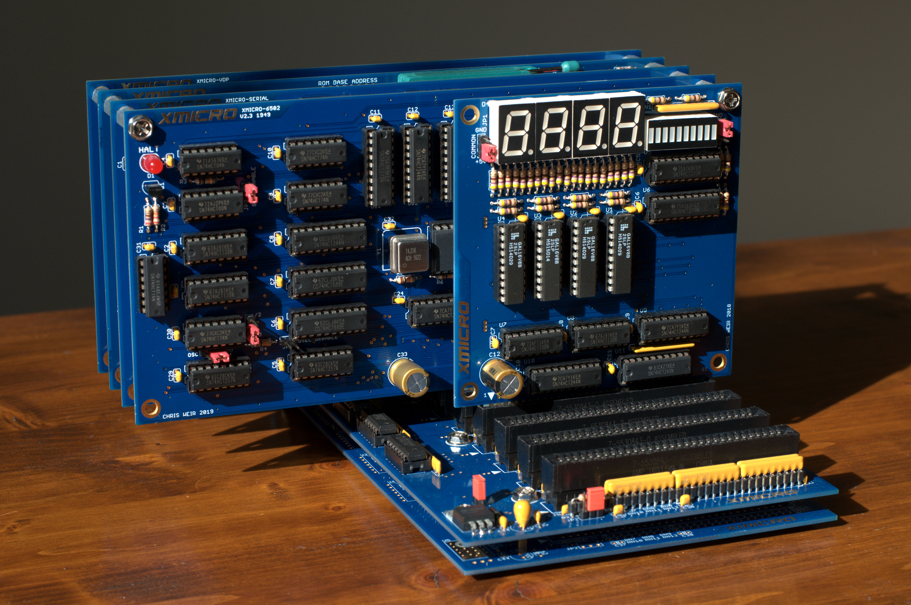
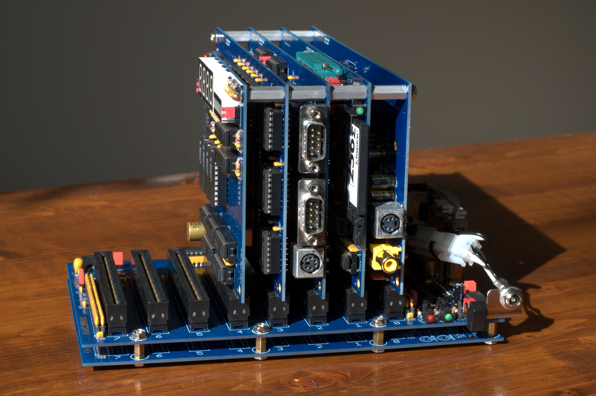

# XMICRO: A Modular 8-bit Microcomputer System
The XMICRO project began in 2017 as a hobby retrocomputer. Descending from a simple 6502-based breadboard computer, the decision was made to create a system which doesn't depend on a particular CPU architecture. In this way, many CPUs could be used for experimentation without the need to create an entire computer system around each one. The name XMICRO, meaning "variable microarchitecture", is a nod toward technology company names of the microcomputer revolution such as Zilog.

## Current State
The [XMICRO Bus Specification](Documentation/XMICRO%20Bus%20Specification.pdf) is not yet finalized, however many hardware components have been created which make up a functional 6502-based microcomputer. These include:
* [XMICRO-BP8](https://github.com/X-Microsystems/xmicro-bp8): 8-slot backplane
* [XMICRO-6502](https://github.com/X-Microsystems/xmicro-6502): W65C02 CPU card
* [XMICRO-MEMORY](https://github.com/X-Microsystems/xmicro-memory): 1MB RAM, 8kB ROM primary memory card
* [XMICRO-CF](https://github.com/X-Microsystems/xmicro-cf): CompactFlash storage and RTC card
* [XMICRO-SERIAL](https://github.com/X-Microsystems/xmicro-serial): Dual RS-232 and PS/2 communications card
* [XMICRO-VDP](https://github.com/X-Microsystems/xmicro-vdp): Yamaha V9958 video card

At this time, the hardware components are being overhauled as the specification is finalized.

